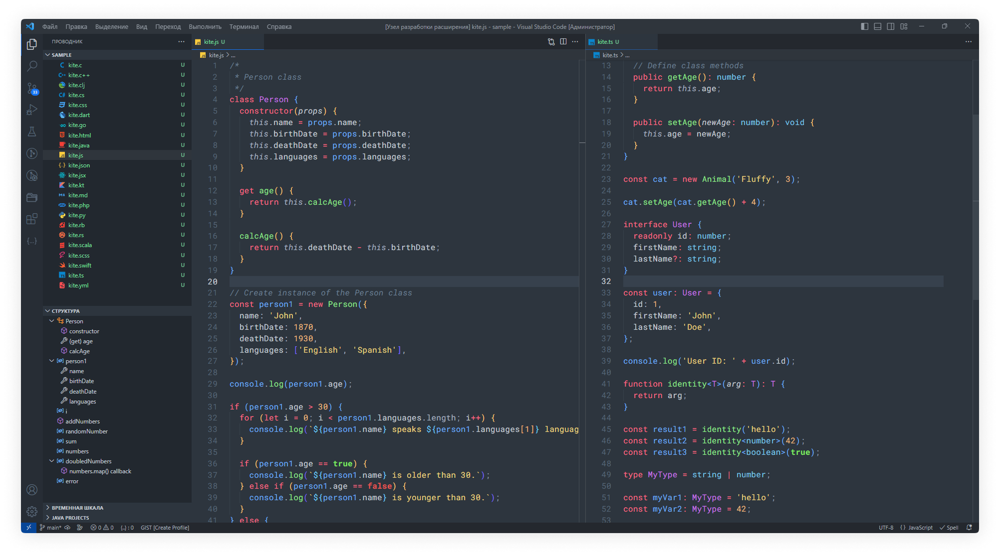
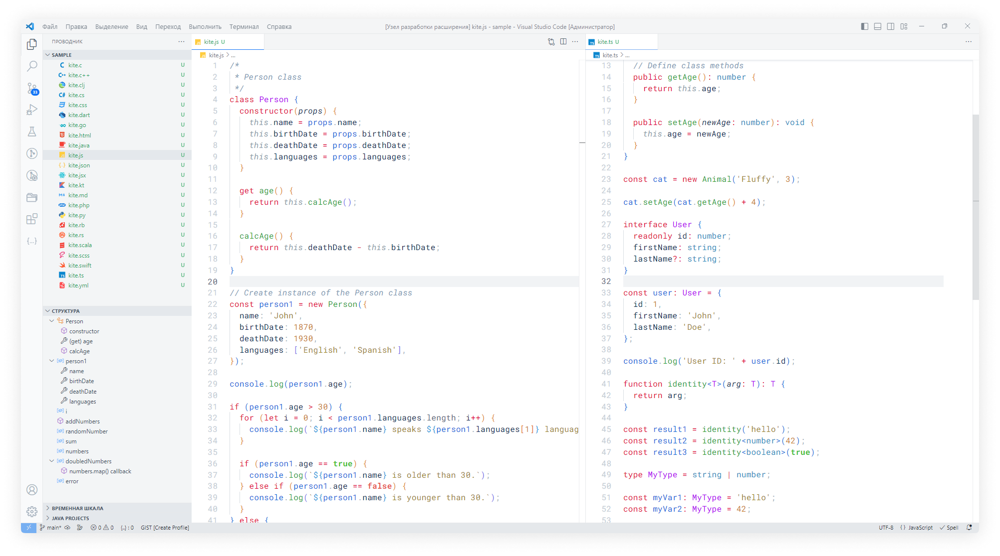
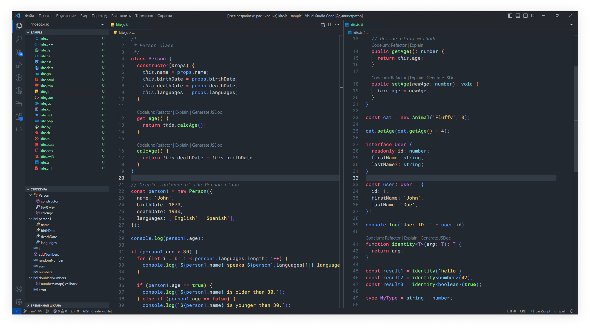

<p align="center">
   
</p>

<h3 align="center">Kite Theme</h3>

<p align="center">
  Kite Theme is a modern and stylish theme that looks really cool with its different colors and simple design.
  <br>
  <a href="https://marketplace.visualstudio.com/items?itemName=yudinikita.vscode-theme-kite"><strong>VS Code Marketplace »</strong></a>
</p>

# 🎨 Kite VS Code Theme

You can choose between **Kite Light**, **Kite Dark** and **Kite Darker** themes. The following languages are supported: `C`, `C++`, `Clojure`, `C#`, `CSS`, `Dart`, `Go`, `HTML`, `Java`, `JavaScript`, `JSON`, `JSX`, `Kotlin`, `Markdown`, `PHP`, `Python`, `Ruby`, `Rust`, `Scala`, `SCSS`, `Swift`, `TypeScript`, `YAML`.

### 🌚 Kite Dark



### 🌝 Kite Light



### 🌑 Kite Darker



## 📝 Getting started

1. Go to the [VS Code Marketplace](https://marketplace.visualstudio.com/items?itemName=yudinikita.vscode-theme-kite).
2. Click on the **Install** button.
3. Then [select a theme](https://code.visualstudio.com/docs/getstarted/themes#_selecting-the-color-theme).
    - `Kite Dark`
    - `Kite Light`
    - `Kite Darker`

## 💬 Note

If you have any suggestions or encounter any problems when using the app, please feel free to contact us by email. I am ready to help you and solve any of your problems.

I used the following settings:

```json
  "window.zoomLevel": -0.5,
  "editor.fontSize": 16,
  "editor.fontWeight": "400",
  "editor.fontFamily": "Roboto mono, JetBrains Mono, Consolas, 'Courier New', monospace",
```

For a light-colored theme, I increase the boldness of the font to 500:

```json
  "editor.fontWeight": "500",
```

## ❤️ Acknowledgments

This project drew inspiration and gained valuable insights from the following sources:

- [One Monokai Theme](https://marketplace.visualstudio.com/items?itemName=azemoh.one-monokai)
- [GitHub Theme](https://marketplace.visualstudio.com/items?itemName=GitHub.github-vscode-theme)

I express my gratitude for their contribution and influence on the development of this project.

## 🔐 License

The source code of this project is licensed under the MIT license, which can be found [here](LICENSE).

---

> nikitayudin782@gmail.com &nbsp;&middot;&nbsp;
> GitHub [@nblackninja](https://github.com/с) &nbsp;&middot;&nbsp;
> Telegram [@yudinikita](https://t.me/yudinikita)
